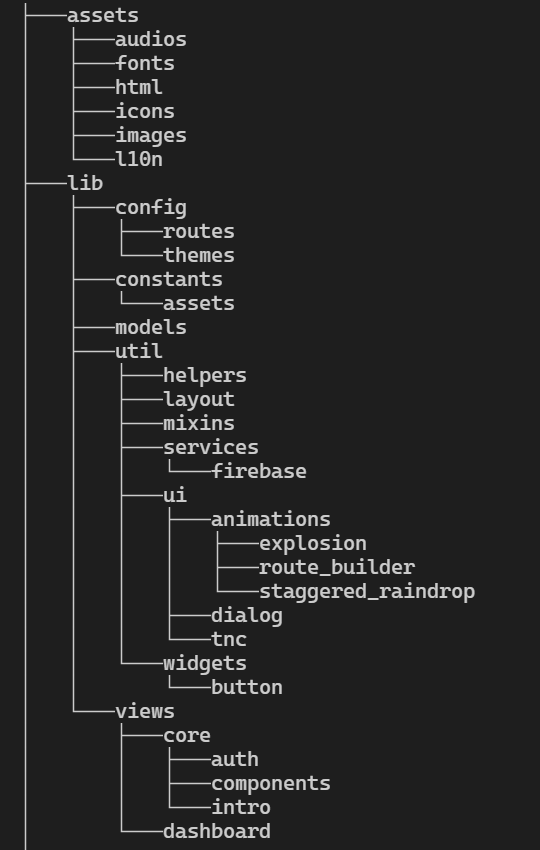

# Flutter App Template
Almost all the code we need to write inside the lib folder and we can see that by default Flutter doesn’t provide any file structure only the main.dart file with one stateful widget is present to run the sample counter.

Now, we will see what folders and files we need to create so that the application will be scalable.

## Get Started

**Step 1:** &nbsp;Clone this repository, then change folder name, because flutter will not accept the name <code>flutter-app-template</code>. As per flutter we should format name like <code>flutter_application_1</code>

**Step 2:** &nbsp;Open terminal, change directory to this repository, then run <code>flutter create .</code>

**Step 3:** &nbsp;Copy dependencies from the **dependencies.txt** file and paste them into pubspec.yaml file, then run <code>flutter pub get</code> command to install dependencies.

**Step 4:** &nbsp;Remove any unwanted dependencies and respective files or part of code, and we're good to go.

**Note:** There is a piece of code for initialisation of SQL, SharedPreferences and Firebase in the file *wrapper.dart* with a method called initTools. We may need to modify/remove this piece of code at some point as per our needs.

## Understand File/Folder Structuring

The image below describes the folder structure, used in this template.

  

**1. Assets:** This folder contains all of the images, icons, fonts, html and i18n.
- **Images:** This is the most important folder where we store all our images.
- **Icons:** Instead of adding icon images in images folder, I created another folder to keep em separate.
- **Fonts:** This folder contains all custom font files.
- **HTML:** This folder contains any HTML content which we need to add in our mobile app (Generally the licensed content of the application or any .html files which we need to load in the application.
- **I18N:** If our application supports Internationalization then need to add .json files for all the supporting different languages i.e If we need to support English and French then need to add en.json and fr.json in this folder.

**2. Config:** This folder contains routes and themes related configurations.

- **Routes:** This folder contains three files namely *route_config.dart, route_handler.dart,* and *routes.dart*. See references for more info.

- **Themes:** This folder contains data for different themes supported by our app usually light and dark, initialisation of controller with identifier *appTheme* is already added in the main.dart file, only thing we need to change is theme data for light and dark themes.

**3. Constants:** This is where all our application constants will be present. It contains four different files namely *api.dart, app.dart, asset.dart,* and *const.dart*. All these files are self-descriptive.
- **app.dart:** Any info that is related to our application that we can use throughout our application will be present in this file.
- **asset.dart:** Although we have described the assets path in pubspec.yaml but to use that asset in an application we need to give there relative path in any widgets. If we add all the assets relative path in one file then it will be easy for us to get all the paths and update the path if required in the future.
- **const.dart:** All of the global constants will be present in this file.

**4. Util:** All of the utilities like helper functions, mixins, services, ui material goes inside this folder which can be used throught the application.
- **Helpers:** In many scenarios, we need to write code multiple times for the same thing like converting the every word first characters to be uppercase. This kind of code can be made common to reduce the redundancy and add that code in helpers files which are present in lib/utils/helpers/text_helper.dart.

- **Services:** Code for any service like sql, shared_pref, firebase, aws, or other will go inside this folder, and code for services like *firebase, sqflite,* and *shared_preferences* is already been added here, we can modify these services as per our needs."

- **UI:** All the common UI related things will go inside this folder like custom animations, custom dialogs, and custom widgets like an input text box with search icon, autocomplete widgets, Error message banners, custom checkbox chips related utils can be present in this file and will be used thoughout the application.

- **Widgets:** In a large scale application, we need to make more customized widgets rather than flutter default widgets. Suppose we need to make use of our own custom ElevatedButton, Divider etc which we can use throughout our application then that kind of customization widgets will be present inside this widgets.

**5. Views:** All of the screens/pages that will be visible to the user will go inside this folder.
- **Core:** Core features like Login/auth, walkthrough screens (Screens which are only visible at after the install only), application setting features are the core features that should be added in this folder.

- **Modules:** Views folder further contain folders for every module we are going to use in our app, and each module can again contain multiple folders so that we can separate our presentation from business logic. See References for more info.

**Note:** I have created a file called *utils.dart* which exports all of the utilities inside the utils folder so importing only *utils.dart* in other files is enough and similarly there's a *config.dart* file.

*wrapper.dart* file inside *views/core/* folder contains code for the possible entry point when our application starts-up, and *wrapper.dart* file also contains some piece of code that initialises SQL, SharedPrefrences and Firebase with a method called initTools(). We may need to modify/remove this piece of code at some point as per our needs.

## References
Article by Flutter Community: [medium.com/flutter-community](https://medium.com/flutter-community/flutter-scalable-folder-files-structure-8f860faafebd)  
Article by GeeksForGeeks: [geeksforgeeks.org/flutter-file-structure](https://www.geeksforgeeks.org/flutter-file-structure/)  
Bloc Pattern: [Getting started with Flutter Bloc Pattern](https://www.mitrais.com/news-updates/getting-started-with-flutter-bloc-pattern/),
[Architect your Flutter Project using Bloc](https://medium.com/codechai/architecting-your-flutter-project-bd04e144a8f1)  
Bloc Library: [bloclibrary.dev/gettingstarted](https://bloclibrary.dev/#/gettingstarted)   

## Find me around web: 

- Sharing amazing articles on <a href="https://priyank-kumar-singh.medium.com/">Medium</a> 📰
- Sharing updates on <a href="https://www.linkedin.com/in/priyank-kumar-singh-705/">LinkedIn</a> 💼

